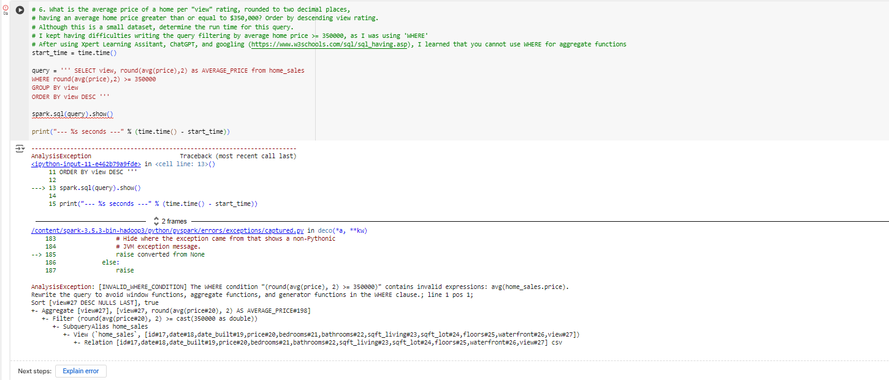
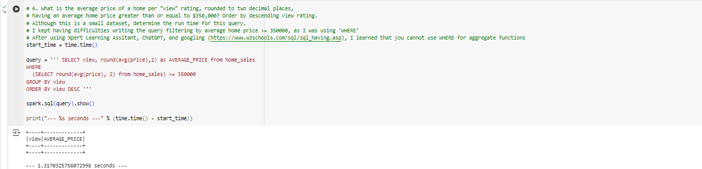
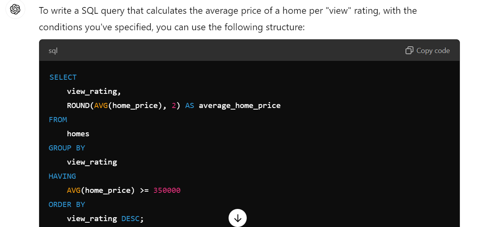
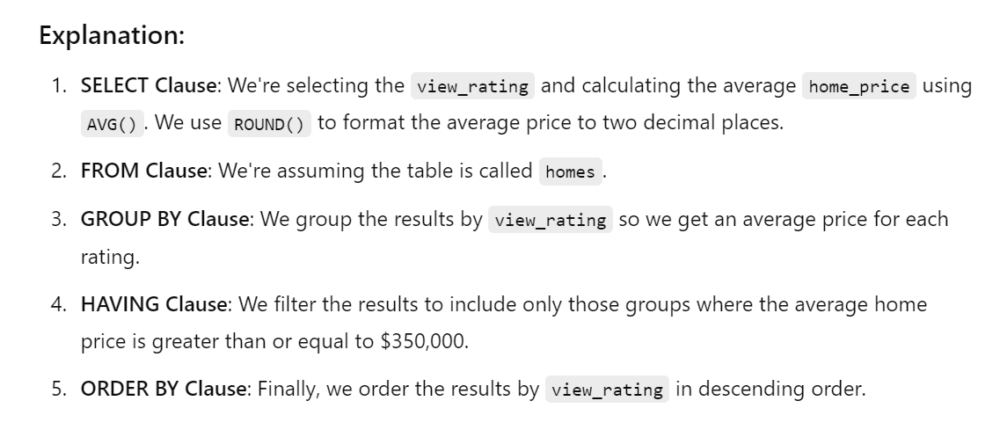
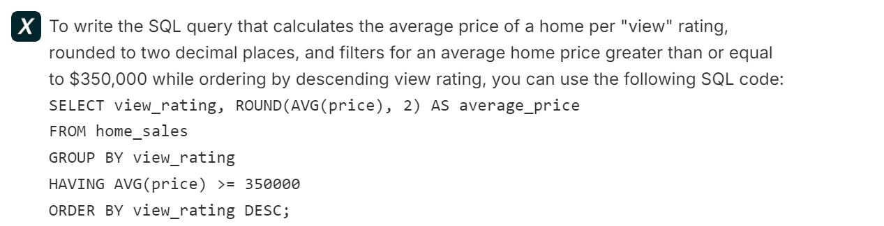
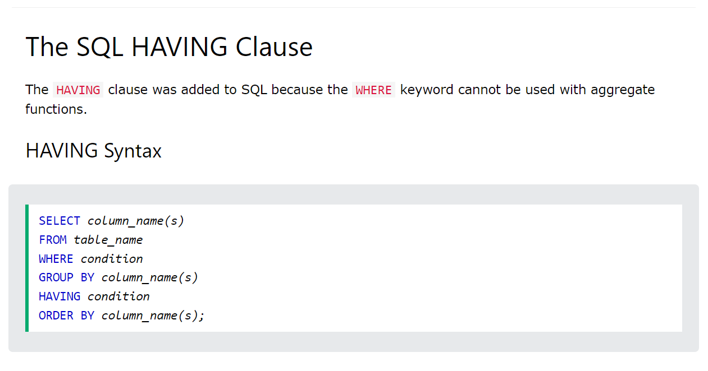

# Home_Sales

For the query involving retrieving the average home price for each 'view' for average prices that are $350,000 and ordering by largest view to smallest view, I used Xpert Learning Assistant, ChatGPT, and the website (https://www.w3schools.com/sql/sql_having.asp) to write and understand the query. Prior to using AI, I wrote the query, attempting to filter the views with averages greater than or equal to $350,000 using the keyword 'WHERE', and I ran into an error as shown below. </li>

I also tried a nested query in the query, but to be honest, I still do not understand how to write and use nested queries. </li>

I then asked ChatGPT and Xpert Learning how to write the query. The first two following images are ChatGPT. The third image is that of Xpert Learning</li>
 </li>

I noticed both ChatGPT and Xpert Learning used the keyword 'HAVING' in the query, so I googled the keyword 'HAVING' in SQL queries. I found the following source. 

